## 2009指令
le scan rsp 是用来回对端信息的
le这种东西，直接用nrf connect应用来解说
下拉扫描直接把所有广播都读进来，然后发scan req过去，收到对端的scan rsp之后
就可以解释出蓝牙广播名称，功率，还可以带uuid，
complete local name
tx power
uuid 
manufacturer data
所以目前设置的2009是给对端nrf connect扫描的
这个框架只是为了熟悉android bluetooth而已
## anroid蓝牙框架
整个bluedroid可以分为两大模块：BTIF，BTE
BTIF：提供bluedroid对外的接口
BTE：bluedroid的内部处理，又细分为BTA，BTU，BTM和HCI
BTA：bluedroid中各profile的逻辑实现和处理
BTU：承接BTA与HCI
BTM：蓝牙配对与链路管理
HCI：读取或写入数据到蓝牙hw
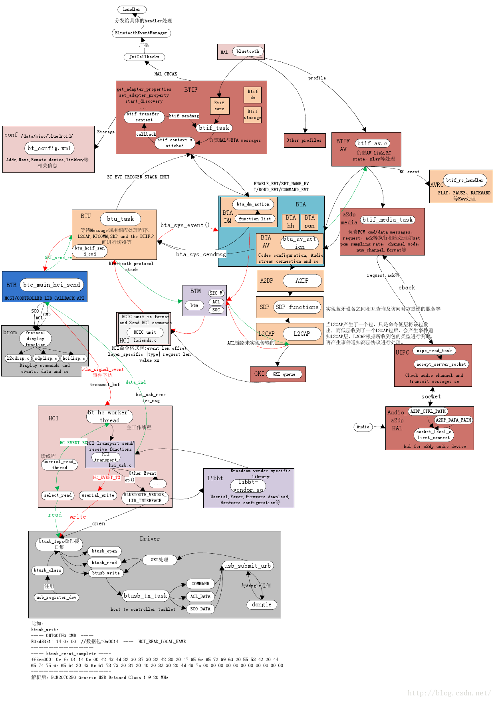

## 第一步：2009指令封装
第一层BTM 2009指令的函数回溯,最底层就是BTM将HCI指令封装起来
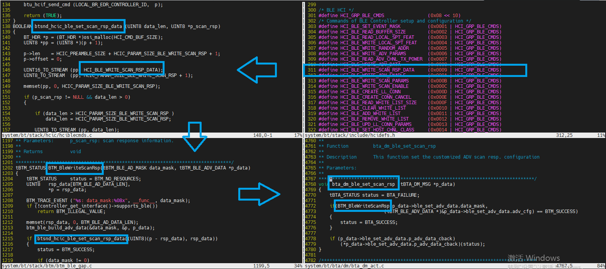

## 第二步：bta
BTA找到bta dm action(将btm的函数聚集起来)，发现这里有功能函数枚举，这里是BTA接口，bluedroid的第二层是BTA,这部分的接口是dm action，封装第一层。
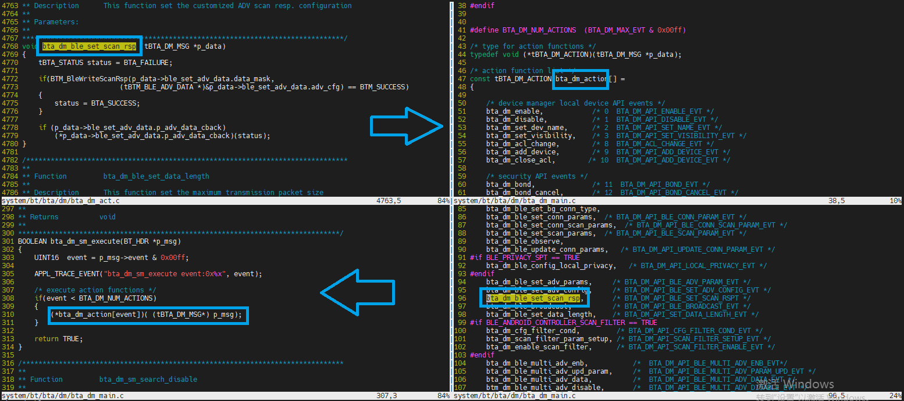

## 第三步：btif
通过event来选择跑哪个cmd，枚举cmd，枚举event，对应起来，然后用event调用对应的cmd，通过send message的异步方式去调用接口，bluedroid的第三层是BTIF,这部分是调用BTA的是dm action，封装第二层，没有明显的封装，就是普通调用，BTIF是给JNI接口的
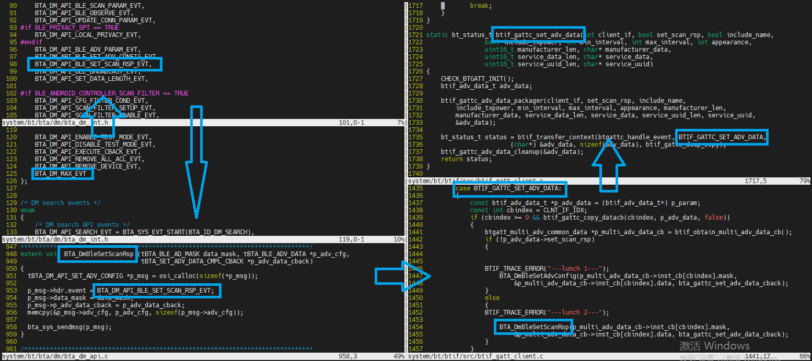

## 第四步：btif封装JNI
封装BTIF到btgatt_client_interface_t，建立gatt interface，提供给JNI gatt.cpp调用
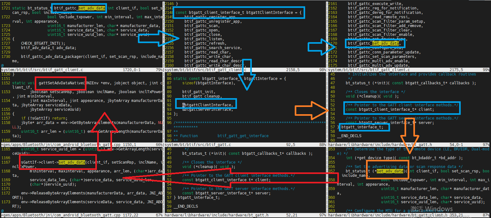

## 第五步：JNI调hardware
【从上调下】 #define BT_HARDWARE_MODULE_ID "bluetooth"，JNI是直接dlopen打开hardware层hw_module_t xxx.so的代码位置，通过ELF文件的代码位置拿到接口，拿到接口之后就比对ID，ID的比对在hw_get_module函数上面，然后拿到接口可直接调用
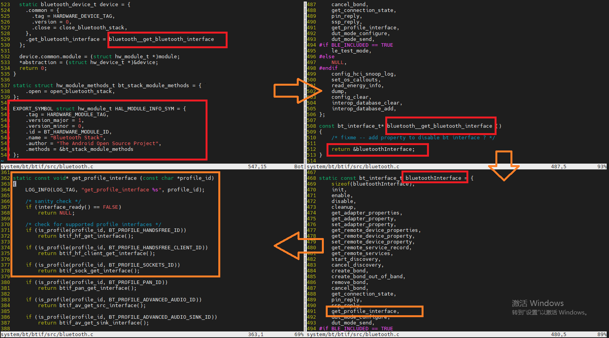

## 第六步: JNI与xxx.so的关系
JNI的initializeNative拿到hardware gatt的句柄还有将gatt callback的句柄传到下面去，这个回调函数有两个特点，一是被动性，二是异步。上层下一个cmd下去，event上来的时候就要用回调函数，因为是被动的，还有时间不定是异步的，回调上传event带的data再通过sendMessage的方式通知到上层
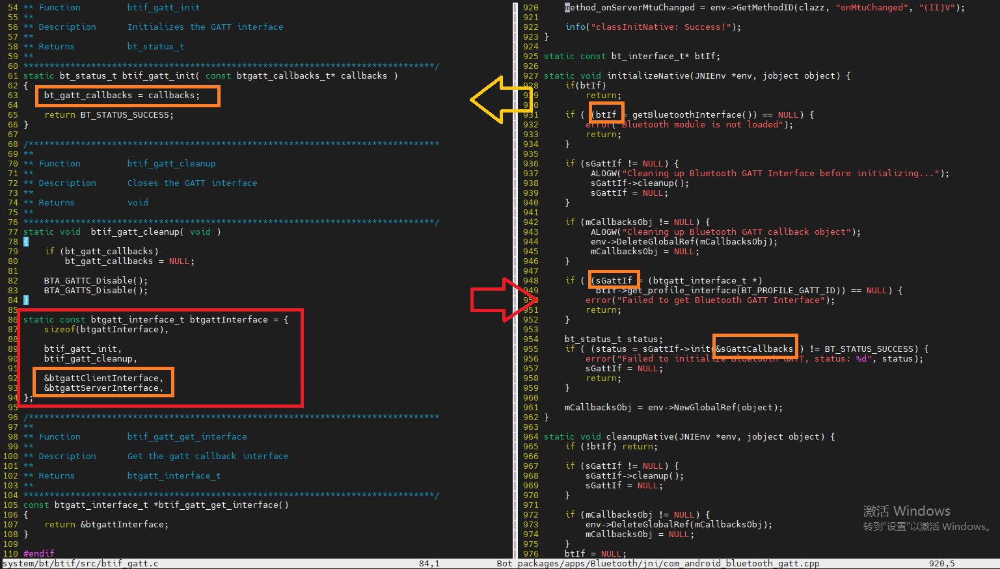

## 第七步：JNI接口通过路径方式注册到上层，注册到AMS后台，framework前端只能通过aidl的asInterface方式调用
JNI的Native我们有框图分析，就是注册到AMS后台的，先注册到AdvertiseManager.java最后注册到GattServce.java这个上面，并不是注册到framework，而且framework就是一个前端，这个时候可以类比一下bluez上的dbus框架，proxy add就是AMS加载蓝牙各个profile service的时候，proxy remove就是释放service，org.bluez.xxx的接口就是类似于framework aidl，只有proxy add（蓝牙service注册之后） ，framework才能binder上这个接口，所以app端调用aidl的开发就是前端开发，C/S的框架，当然很多时候也会改到AMS的部分，比如蓝牙wifi的state machine，proxy/aidl 就是一个接口，不管是C/S框架中 S(服务端)部分的哪一块肉，反正就是open/asInterface开来给C(客户端)用的，而且这个接口不是一直都有的，注册了才会有，remove了就没有了，之所以叫proxy也是因为它的动态性。
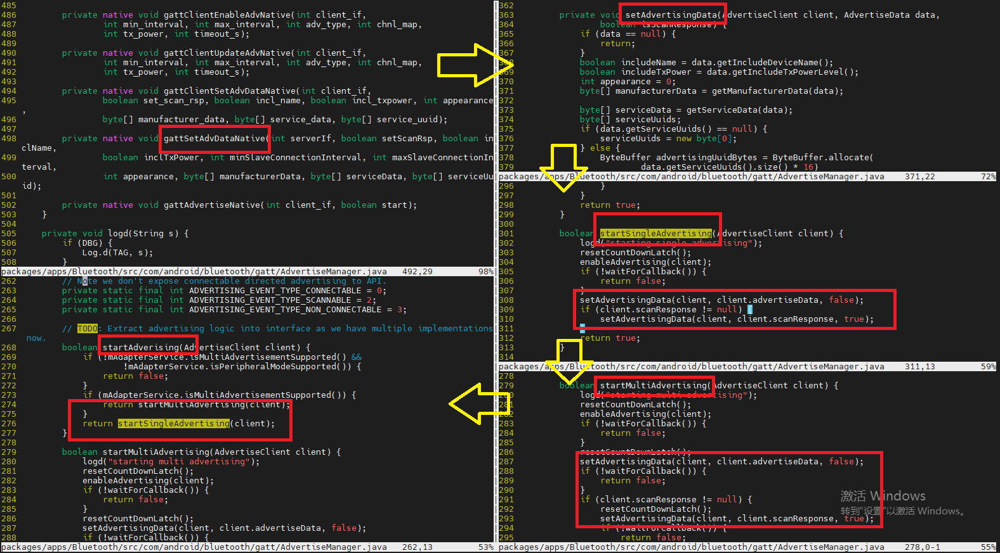
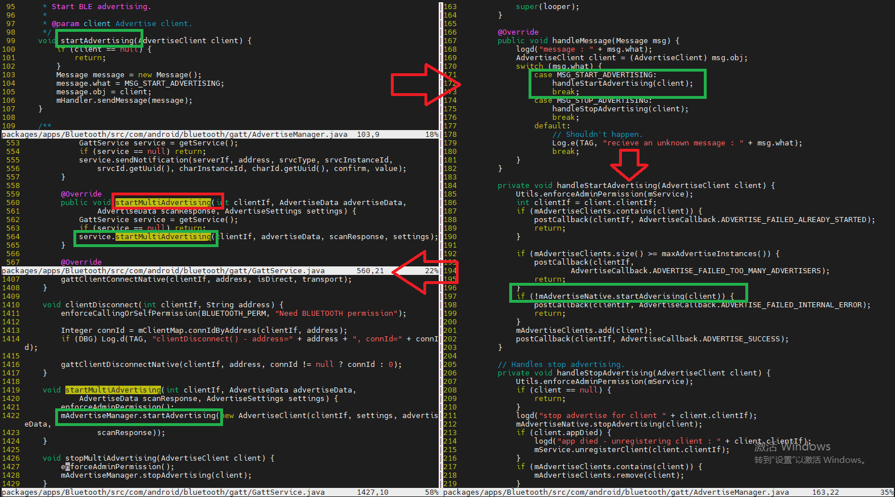

## 第八步 蓝牙AMS后台启动
C/S框架，蓝牙的各个profile service后台需要实体化跑起来，然后framework前端才能通过aidl bind的方式去调用。
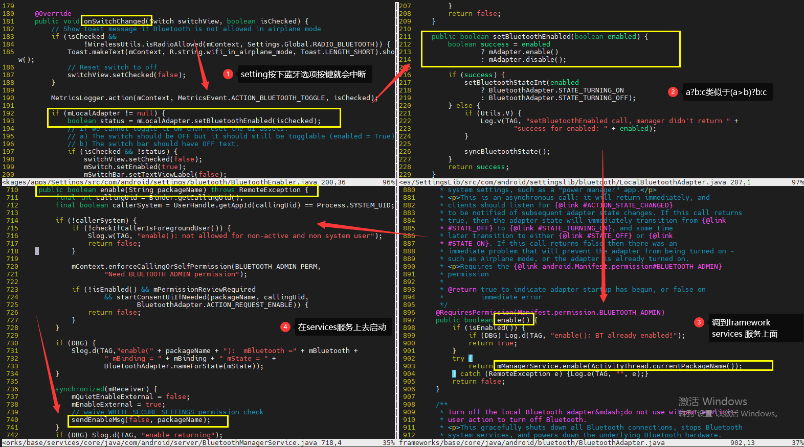
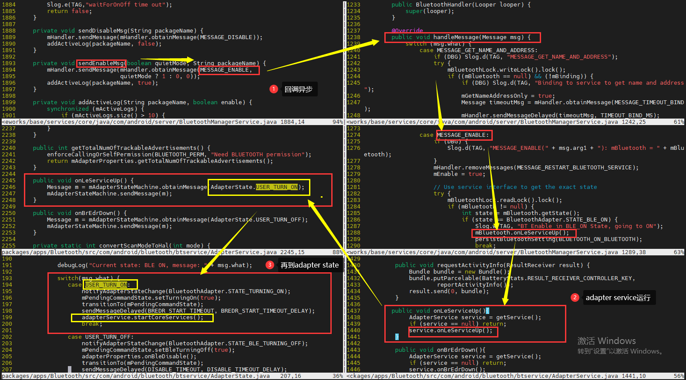
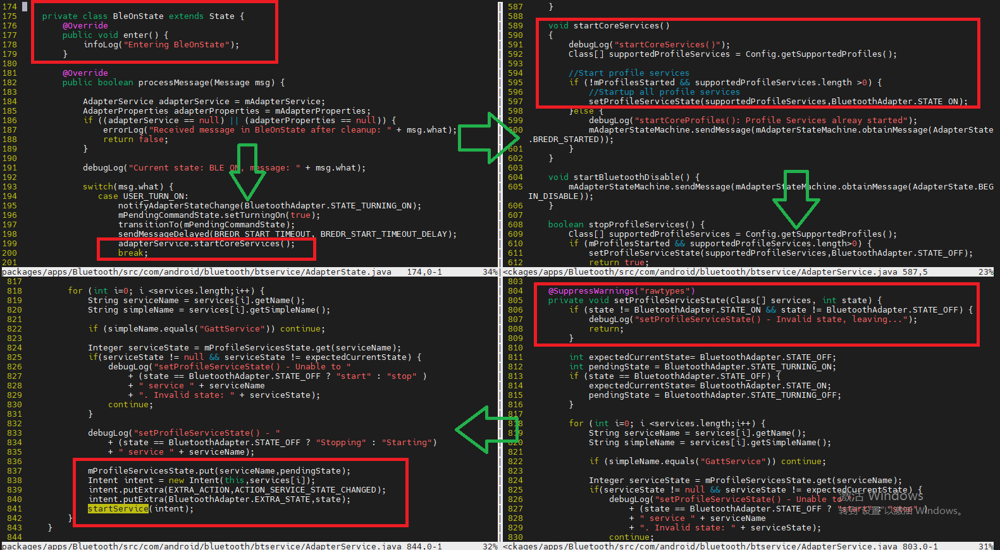
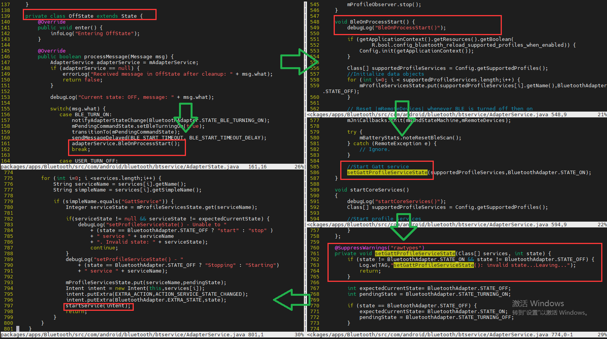

