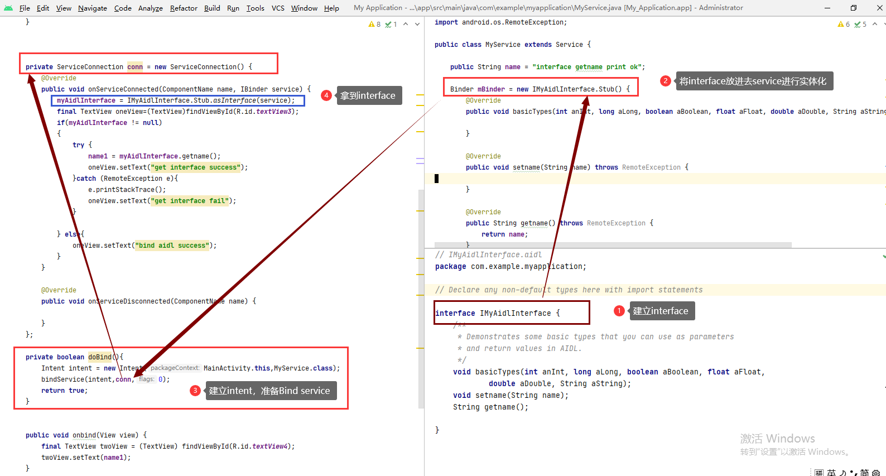
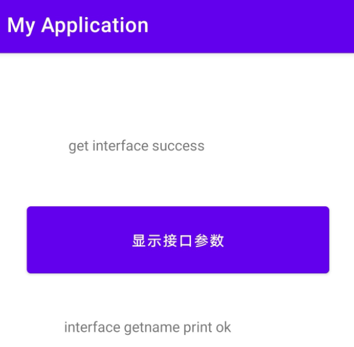
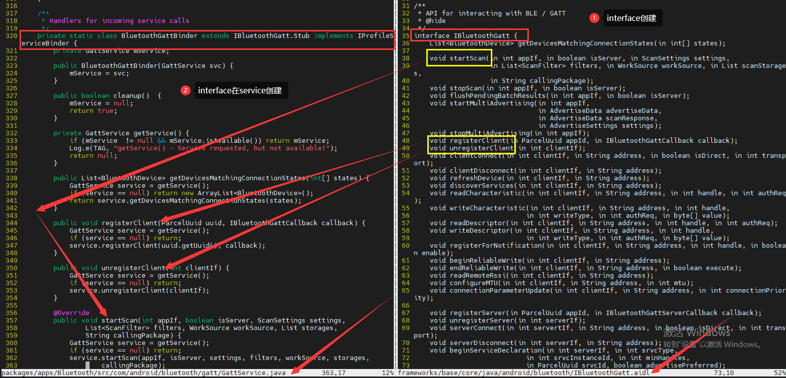
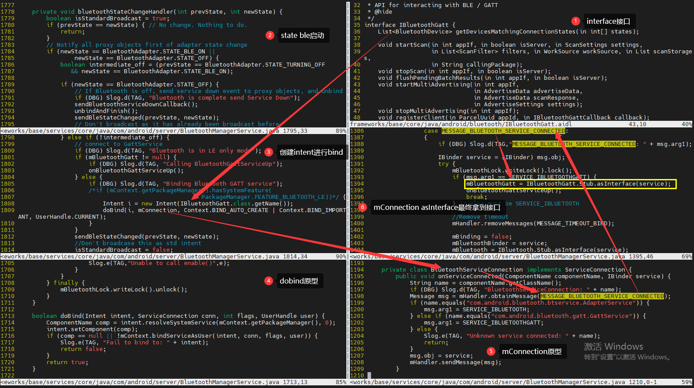

## aidl测试实例
这个部分是service onbind return的是aidl接口，和普通return不一样
测试效果，这个是需要先startService才能bind aild


### Mainactivity
```

public class MainActivity extends AppCompatActivity {
 
    private IMyAidlInterface myAidlInterface;
    private String name1;
 
 
    @Override
    protected void onCreate(Bundle savedInstanceState) {
        super.onCreate(savedInstanceState);
        setContentView(R.layout.activity_main);
        Intent intent = new Intent(MainActivity.this,MyService.class);
        startService(intent);
        doBind();
    }
 
 
 
    private ServiceConnection conn = new ServiceConnection() {
        @Override
        public void onServiceConnected(ComponentName name, IBinder service) {
            myAidlInterface = IMyAidlInterface.Stub.asInterface(service);
            final TextView oneView=(TextView)findViewById(R.id.textView3);
            if(myAidlInterface != null)
            {
                try {
                    name1 = myAidlInterface.getname();
                    oneView.setText("get interface success");
                }catch (RemoteException e){
                    e.printStackTrace();
                    oneView.setText("get interface fail");
                }
 
            } else{
                oneView.setText("bind aidl success");
            }
        }
 
        @Override
        public void onServiceDisconnected(ComponentName name) {
 
        }
    };
 
    private boolean doBind(){
        Intent intent = new Intent(MainActivity.this,MyService.class);
        bindService(intent,conn,0);
        return true;
    }
 
 
    public void onbind(View view) {
        final TextView twoView = (TextView) findViewById(R.id.textView4);
        twoView.setText(name1);
    }
}
```
### aidl interface
```

interface IMyAidlInterface {
    /**
     * Demonstrates some basic types that you can use as parameters
     * and return values in AIDL.
     */
    void basicTypes(int anInt, long aLong, boolean aBoolean, float aFloat,
            double aDouble, String aString);
    void setname(String name);
    String getname();
 
}
```
### service
```
public class MyService extends Service {
 
    public String name = "interface getname print ok";
 
    Binder mBinder = new IMyAidlInterface.Stub() {
        @Override
        public void basicTypes(int anInt, long aLong, boolean aBoolean, float aFloat, double aDouble, String aString) throws RemoteException {
 
        }
 
        @Override
        public void setname(String name) throws RemoteException {
 
        }
 
        @Override
        public String getname() throws RemoteException {
            return name;
        }
    };
 
    public MyService() {
    }
 
    public void onCreate(){
 
        super.onCreate();
 
    }
    @Override
    public IBinder onBind(Intent intent) {
        // TODO: Return the communication channel to the service.
 
        return mBinder;
    }
 
 
    public void setname(String name){
 
 
    }
 
    public String getname(){
 
        return name;
 
    }
 
}

```
## android framework bind service aind
BluetoothManagerService.java
framework==>aidl==>JNI==>BTIF==>BTM




